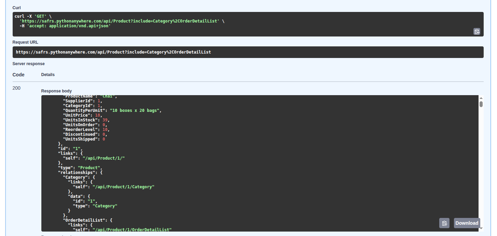

[](https://pypi.python.org/pypi/safrs/)
[](https://pypi.python.org/pypi/safrs/)
[](https://www.gnu.org/licenses/gpl-3.0)

# SAFRS

Expose SQLAlchemy models as JSON:API resources and generate API documentation with minimal boilerplate.

SAFRS is built around SQLAlchemy models and JSON:API-style resource handling. The repository includes FastAPI and Flask adapters.



## Start here

- [Wiki home](https://github.com/thomaxxl/safrs/wiki)
- [Installation](https://github.com/thomaxxl/safrs/wiki/Installation)
- [Quickstart (Flask)](https://github.com/thomaxxl/safrs/wiki/API-Creation)
- [Quickstart (FastAPI)](https://github.com/thomaxxl/safrs/wiki/Quickstart-FastAPI)
- [Examples](https://github.com/thomaxxl/safrs/wiki/Examples)

## Functionality

- JSON:API collection and instance endpoints for SQLAlchemy models
- relationship endpoints and `include` support
- filtering, sorting, pagination, sparse fieldsets, and bulk request support
- custom RPC methods with `@jsonapi_rpc`
- generated Swagger / OpenAPI documentation
- serialization hooks, computed attributes, and model-level customization
- stateless service-style endpoints through `JABase`

## Install

SAFRS currently requires Python `>=3.10`.

Install from PyPI:

```bash
pip install safrs
```

Editable install from a clone:

```bash
git clone https://github.com/thomaxxl/safrs
cd safrs
python -m venv venv
source venv/bin/activate
pip install -e .
```

For the FastAPI examples, also install:

```bash
pip install "fastapi[standard]" uvicorn
```

For the broader example set, including auth and admin examples:

```bash
pip install -r examples/requirements.txt
```

More setup details: [Installation wiki page](https://github.com/thomaxxl/safrs/wiki/Installation)

## Quick start from this repository

SAFRS models inherit both `SAFRSBase` and the SQLAlchemy model base. You then expose them with:

- `SafrsApi(...).expose_object(Model)` for Flask
- `SafrsFastAPI(...).expose_object(Model)` for the FastAPI adapter

Run the smallest Flask example:

```bash
python examples/mini_app.py
```

Run the smallest FastAPI example:

```bash
python examples/mini_fastapi_app.py
```

Quickstarts and walkthroughs:

- [Quickstart (Flask)](https://github.com/thomaxxl/safrs/wiki/API-Creation)
- [Quickstart (FastAPI)](https://github.com/thomaxxl/safrs/wiki/Quickstart-FastAPI)

## Example files worth opening first

- [`examples/mini_app.py`](examples/mini_app.py) — smallest Flask example
- [`examples/demo_relationship.py`](examples/demo_relationship.py) — relationships and includes
- [`examples/mini_fastapi_app.py`](examples/mini_fastapi_app.py) — smallest FastAPI example
- [`examples/demo_fastapi.py`](examples/demo_fastapi.py) — fuller FastAPI demo
- [`examples/demo_pythonanywhere_com.py`](examples/demo_pythonanywhere_com.py) — broader Flask showcase
- [`examples/demo_stateless.py`](examples/demo_stateless.py) — stateless / non-SQLAlchemy-style resource example

The full examples index is in the wiki: [Examples](https://github.com/thomaxxl/safrs/wiki/Examples)

## Documentation map

Getting started:

- [Installation](https://github.com/thomaxxl/safrs/wiki/Installation)
- [Quickstart (Flask)](https://github.com/thomaxxl/safrs/wiki/API-Creation)
- [Quickstart (FastAPI)](https://github.com/thomaxxl/safrs/wiki/Quickstart-FastAPI)

Core JSON:API behavior:

- [JSON:API basics](https://github.com/thomaxxl/safrs/wiki/API-Functionality)
- [Relationships and includes](https://github.com/thomaxxl/safrs/wiki/Relationships-and-Includes)
- [Filtering](https://github.com/thomaxxl/safrs/wiki/JsonApi-filtering)
- [Sorting, pagination, and sparse fieldsets](https://github.com/thomaxxl/safrs/wiki/Sorting-Pagination-and-Sparse-Fieldsets)
- [Content types and errors](https://github.com/thomaxxl/safrs/wiki/Content-Types-and-Errors)
- [Bulk requests](https://github.com/thomaxxl/safrs/wiki/Bulk-Requests)

Customization and extension:

- [RPC / custom methods](https://github.com/thomaxxl/safrs/wiki/RPC)
- [HTTP methods and hooks](https://github.com/thomaxxl/safrs/wiki/HTTP-Methods)
- [Endpoint decorators](https://github.com/thomaxxl/safrs/wiki/HTTP-Method-Decorators)
- [Serialization and `jsonapi_attr`](https://github.com/thomaxxl/safrs/wiki/JSON-encoding-and-decoding)
- [Security and access control](https://github.com/thomaxxl/safrs/wiki/Access-Control)
- [Configuration reference](https://github.com/thomaxxl/safrs/wiki/Configuration-Reference)

Advanced topics:

- [Stateless endpoints / JABase](https://github.com/thomaxxl/safrs/wiki/Instances-without-a-SQLAlchemy-model)
- [Troubleshooting](https://github.com/thomaxxl/safrs/wiki/Troubleshooting)
- [Docker / deployment](https://github.com/thomaxxl/safrs/wiki/Docker)
- [Existing databases (legacy)](https://github.com/thomaxxl/safrs/wiki/Exposing-Existing-Databases)

## Notes

- Flask is still the main documented SAFRS path.
- The FastAPI adapter exists in the repository and is documented, but it should still be treated as experimental.
- The older expose-existing-database workflow is no longer the main recommended entry point and is kept as legacy documentation.

SAFRS originally stood for **SqlAlchemy Flask-Restful Swagger**. The project has since grown beyond the original Flask-only framing, but the historical name remains.


