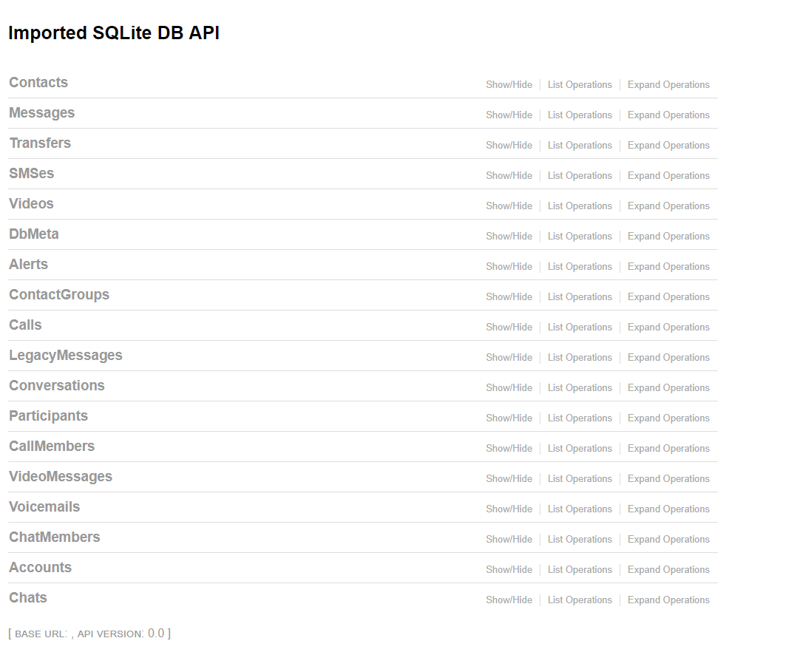

## Basic Use Case
demo.py : a small sample application
example use:
```bash
PYTHONPATH=$PWD python3 examples/demo.py 10.0.0.9
```

## Relationships
demo_relationship.py : an extension of the demo.py to demonstrate relationship functionality

## Expose an Existing Database

skype_rest.py contains example code where I expose an existing database (skype's main.db) as a webservice

```bash
$ python3 skype_rest.py 10.0.52.23
```

gives the following 




