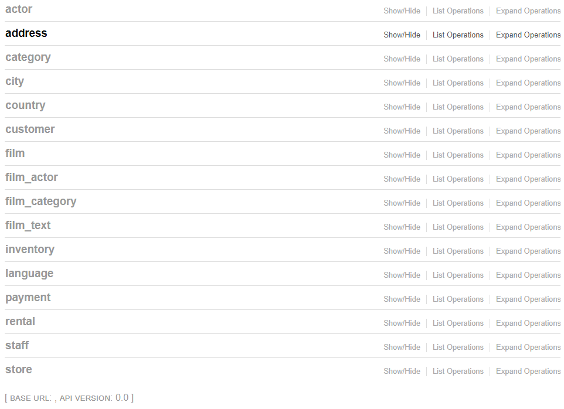

# Examples

This folder contains some example applications demonstrating different functionality of SAFRS.

## Basic Use Case
[mini_app.py](mini_app.py) : a small sample application
The example can be started with
```bash
PYTHONPATH=. FLASK_APP=mini_app flask run
```

## Relationships
[demo_relationship.py](demo_relationship.py) : an extension of the mini_app.py to demonstrate relationship functionality. Ex.:
```bash
python3 demo_relationship.py 172.16.9.12
```

## Bigger Example
The [demo_pythonanywhere_com.py](demo_pythonanywhere_com.py) example is deployed [here](http://thomaxxl.pythonanywhere.com/). It demonstrates different functionalities that can be used. Ex.:
```bash
python3 demo_pythonanywhere_com.py 172.16.9.12
```

note, you may have to install the [requirements.txt](requirements.txt) dependencies, or install safrs with
`pip install safrs[admin]`

## Example without SQLAlchemy Model
The [demo_stateless.py](demo_stateless.py) example demonstrates how to create an exposed object that is not based on an SQLAlchemy instance.

## GeoAlchemy2 example
[demo_geoalchemy.py](demo_geoalchemy.py)

## Expose Existing Databases:

It is possible to expose existing databases, as an example I implemented the [employees](https://github.com/datacharmer/test_db) and [sakila](https://github.com/datacharmer/test_db/sakila) MuySQL test databases with safrs.

For this to work, I used a modified [sqlacodegen](https://github.com/thomaxxl/safrs/tree/master/sqlacodegen) to generate the sqlalchemy models [sakila.py](sakila.py) and [employees.py](employees.py) .

The Flask webservices are created with [expose_sakila.py](expose_sakila.py) and [expose_employees.py](expose_employees.py). They can be started as usual:

```bash
$ python3 examples/expose_employees.py 172.1.1.2 5000
```

Exposed sakila database:




Unfortunatley, the code generated with sqlacodegen needed some manual changes before it was usable. For example, the declarative column types for INTEGER and SMALLINT didn't work so I had to create small wrappers to fix this:
```python
def SMALLINT(_):
    return db.SMALLINT

def INTEGER(_):
    return db.INTEGER
```

You may run into similar problems trying to expose other schemas. These problems may be hard to solve if you're unfamiliar with SQLAlchemy. 
Feel free to open a github issue and I'll try to help you out.
